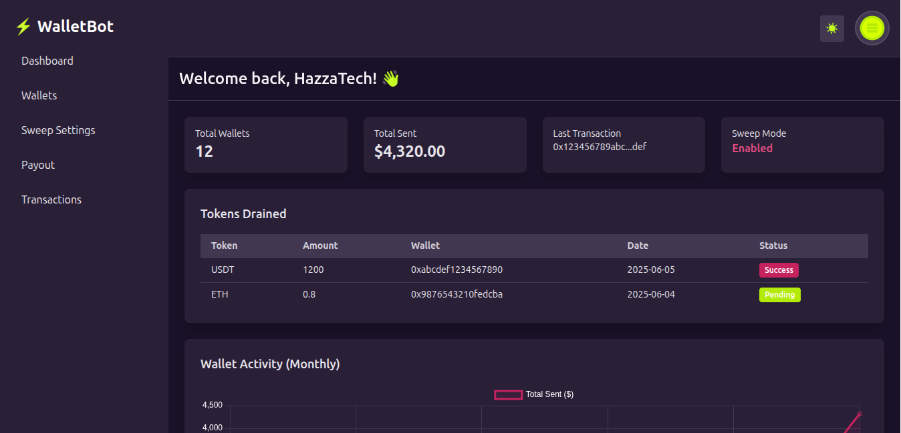

# 💸 Laravel Wallet Sweeper & Payout System

This is a Laravel-based backend system for managing multiple wallets, sweeping tokens to a central wallet, and autom## 📸 Screenshots
/public/screenshots/drainer-image.png
/public/screenshots/finishes ui.pngating payouts. Built for full transparency and real-world Web3 wallet operations.

## 🚀 Features
- Admin dashboard (completed)
- Add and manage wallets
- Sweep mode (auto-transfer to central wallet)
- Payout mode (manual or scheduled)
- Token & ETH support
- Job queue architecture

## 📦 Stack
- Laravel 10+
- TailwindCSS (UI)
- MySQL
- web3p/web3.php (Ethereum interactions)
- Queue workers (for sweeping/payout logic)

## ⚠️ Status
🛠 This project is still in development. Core backend logic is in progress.

## 📸 Screenshots

### 💼 Drainer Interface

### ✅ Finished Admin UI

## 👨‍💻 Author
Maduka Nwoti Harrison Chidubem  
[GitHub](https://github.com/Osinemem1)  
